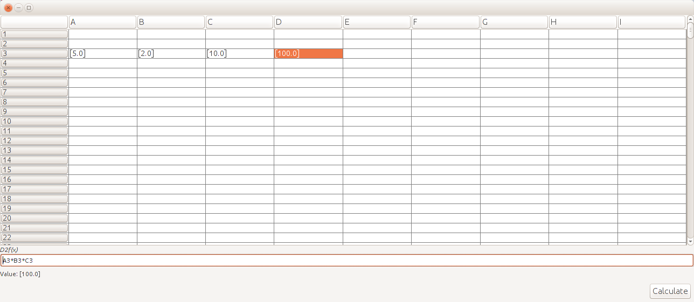
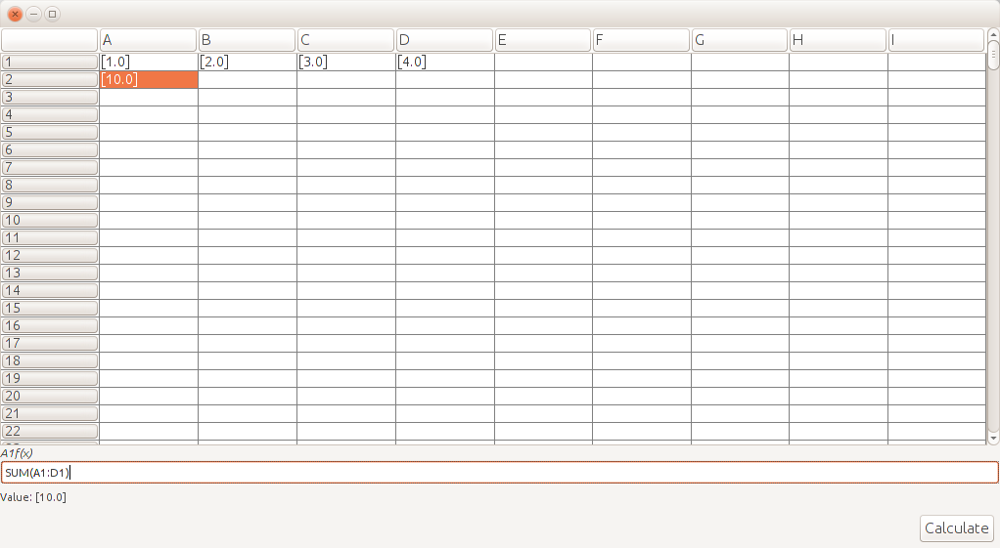

# SimpleCalculator
This project is a showcase of a simple excel like table calculator. 

The calculator supports the following functions:
* Logical:
  * All (Example: ALL(A1:C1>0))
  * Any (Example: ANY(A1:A3<0))
  * And (Example: A1&&A2)
  * Or (Example: A1||A2)
  * Xor (Example: A1^A2)
  * Not (Example: !A1)
  * Equal (Example: A1==A2)
  * Not equal (Example: A1!=A2)
  * Larger (Example: A1>A2)
  * LargerOrEqual (Example: A1>=A2)
  * Smaller (Example: A1<A2)
  * SmallerOrEqual (Example: A1<=A2)
* Mathematical:
  * Plus (Example: A1+A2)
  * Minus (Example: A1-A2)
  * Divide (Example: A1/A2)
  * Multiply (Example: A1*A2)
  * Sin (Example: SIN(A1),SIN(A1,A2),SIN(A1:A5),SIN(A1:A5,A2:D2))
  * Cos (Example: COS(A1),COS(A1,A2),COS(A1:A5),COS(A1:A5,A2:D2))
  * Binary coefficient (Example: BINCOEFF(A1),BINCOEFF(A1,A2),BINCOEFF(A1:A5),BINCOEFF(A1:A5,A2:D2))
  * Count (Example: COUNT(A1),COUNT(A1,A2),COUNT(A1:A5),COUNT(A1:A5,A2:D2))
  * Mean (Example: MEAN(A1),MEAN(A1,A2),MEAN(A1:A5),MEAN(A1:A5,A2:D2))
  * Median (Example: MEDIAN(A1),MEDIAN(A1,A2),MEDIAN(A1:A5),MEDIAN(A1:A5,A2:D2))
  * Sqrt (Example: SQRT(A1),SQRT(A1,A2),SQRT(A1:A5),SQRT(A1:A5,A2:D2))
  * Standard deviation (Example: STDEV(A1),STDEV(A1,A2),STDEV(A1:A5),STDEV(A1:A5,A2:D2))
  * Sum (Example: SUM(A1),SUM(A1,A2),SUM(A1:A5),SUM(A1:A5,A2:D2))
* Bitwise:  
  * Bitwise and (Example: A1&A2)
  * Bitwise or (Example: A1|A2)
  
The following images show the calculator GUI.

